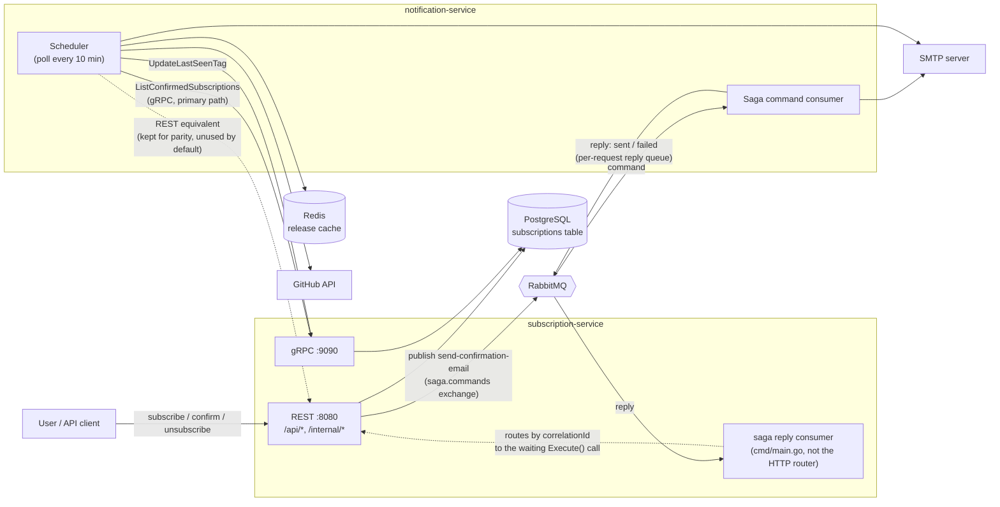
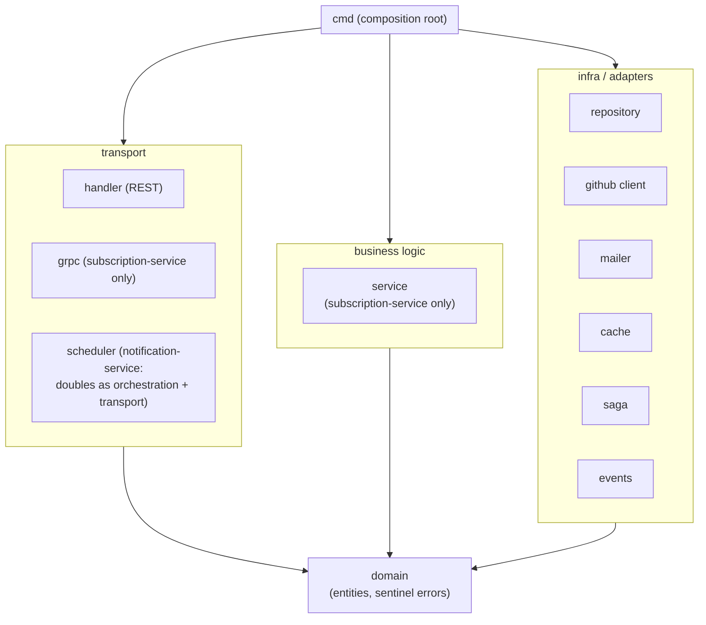
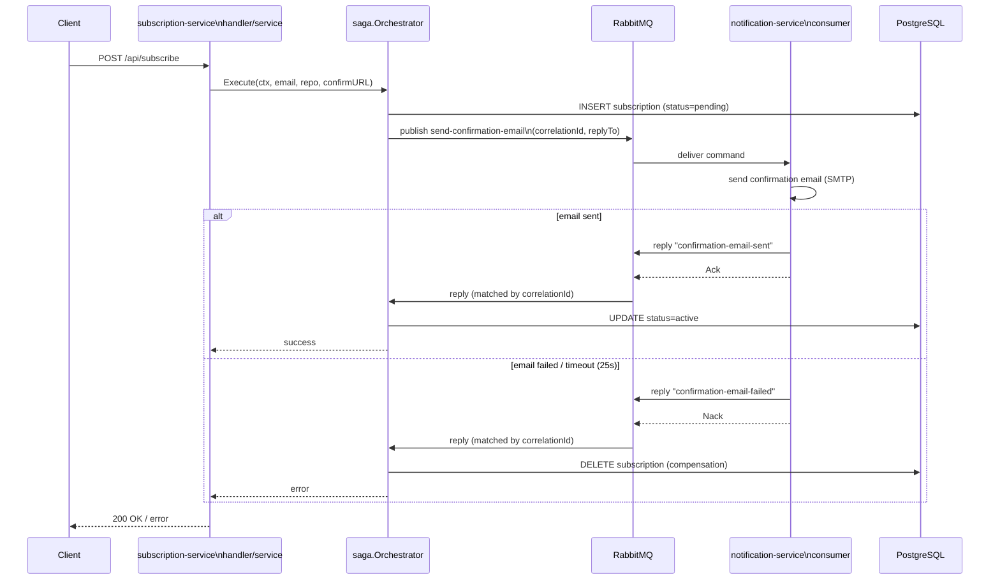

# Architecture

Current state of the system as of `hw9-grpc`: two standalone Go services communicating over
RabbitMQ (async saga) and gRPC/REST (sync queries), each following the same internal layering.

## 1. System context

- **subscription-service** owns all writes (`subscriptions` table) and exposes both REST and gRPC
  read/update surfaces. Public REST is unauthenticated; `/internal/*` REST and the entire gRPC
  server require the `X-Internal-Token` / `x-internal-token` credential.
- **notification-service** never touches the database directly — it only reaches subscription data
  through subscription-service's internal API (gRPC by default, REST kept for parity/benchmarking).
- The Subscribe flow is the one place both services must agree on an outcome (row created +
  email sent) without a shared transaction — that's handled by the saga in §3.

## 2. Layered architecture

Both services follow the same shape: a `domain` package at the center with no internal
dependencies, a ring of infrastructure adapters and a business/orchestration layer that depend
only on `domain`, and a composition root (`cmd/main.go`) that wires concrete adapters into the
business layer. No adapter imports another adapter, and nothing but `cmd` imports more than one
layer — dependencies point inward, never sideways.

| Layer | subscription-service | notification-service | May import |
|---|---|---|---|
| `domain` | entities, sentinel errors | entities, sentinel errors | nothing internal |
| infra/adapters | `repository`, `github`, `saga`, `events`, `db`, `metrics`, `config` | `github`, `mailer`, `cache`, `client`, `events`, `config` | `domain` only |
| business logic | `service` | *(none — folded into `scheduler`)* | `domain` only |
| transport | `handler`, `grpc` | `scheduler` (ticker-driven, not HTTP) | `domain` only |
| composition root | `cmd` | `cmd` | anything |

The transport and business layers never import a concrete adapter package — they declare the
interface they need locally (e.g. `handler` declares its own `SubscriptionService` interface;
`service` declares its own `SubscriptionRepository`/`SagaPublisher` interfaces) and `cmd` satisfies
it by injecting the real adapter. This is why the dependency-test in §4 can enforce "adapters are
leaves" as a hard rule: nothing legitimately needs to import them except `cmd`.

`notification-service` has no separate `service` package because there's no request to handle —
`scheduler` is both the orchestrator (decides when to check a repo and notify) and the transport
(the ticker is its "trigger", the way HTTP is the trigger for `handler`).

## 3. Saga: Subscribe flow

A single shared reply queue is fanned out to concurrent `Execute` callers via a
`pending map[string]chan amqp.Delivery` keyed by correlation ID (`orchestrator.Start(ctx)` runs
the dispatcher goroutine). If no reply arrives within 25s, the orchestrator treats it as a failure
and compensates the same way as an explicit failure reply.

## 4. Architecture-dependency tests (bonus)

`internal/archtest/architecture_test.go` in each service enforces the table in §2 as a real,
CI-executed test (part of `go test ./...`, already covered by `unit.yml`'s per-module matrix):
it shells out to `go list -json ./...`, builds the internal import graph, and fails with a named
package + disallowed import if any package under `internal/` reaches into a sibling adapter or a
higher layer. `cmd` (the composition root) is intentionally exempt and its own imports are not
checked — the test only guards the `internal/` boundary, not what `cmd/main.go` itself does.
