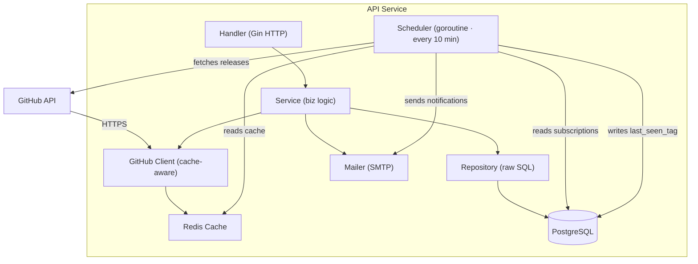
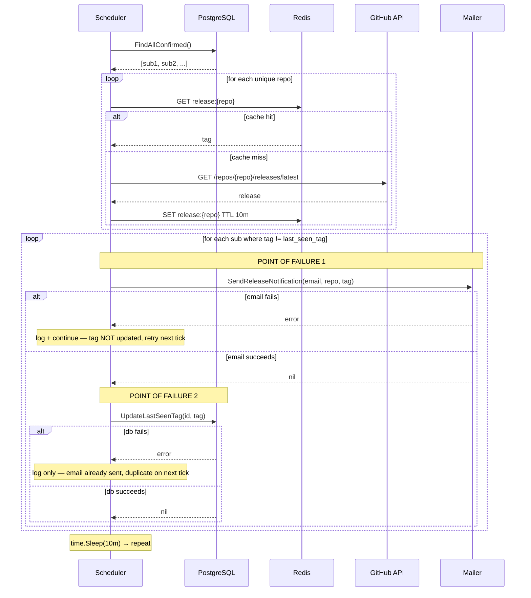

# System Design: GitHub Release Notifier
 
## 1. Context
 
### Problem
Developers who follow multiple GitHub repositories have no reliable way to know when a new release is published without checking manually. Missed releases mean outdated dependencies, skipped security patches, and wasted time.
 
### Goals
 
| Goal | Business outcome |
|------|-----------------|
| Notify subscribers within 10 minutes of a new release | Reduces manual checking → better developer experience |
| Require email confirmation before sending notifications | Reduces spam complaints → higher email deliverability |
| Max 1 notification per release per subscriber (best effort) | Prevents notification fatigue → lower unsubscribe rate |
| User controls which repos they track | Personalization → higher long-term engagement |
| One-click unsubscribe via email link | Compliance + trust → lower churn |
 
### Constraints
 
- **Budget**: minimal infrastructure — single-instance Docker Compose deployment
- **External API**: GitHub API rate limit of 60 requests/hour (unauthenticated)
- **Team**: single developer
- **Compliance**: email addresses are personal data — unsubscribe must always be available
---
 
## 2. Requirements
 
### Functional
- User subscribes to a GitHub repo by providing email and repo identifier (`owner/repo`)
- Subscription is inactive until confirmed via email link
- System polls GitHub for new releases every 10 minutes
- Notification email is sent when a new release tag is detected
- User can unsubscribe via a link included in every notification email
- Duplicate subscriptions (same email + repo) are rejected with a clear error
### Non-functional
 
| Attribute | Target |
|-----------|--------|
| Availability | 99.9% uptime |
| API latency | <200ms for all endpoints |
| Scalability | up to 100K active subscriptions |
| Notification delivery | at-least-once per release |
| Security | all mutations require signed tokens |
| GitHub API usage | authenticated token required at any meaningful scale (see Load Estimate) |
 
---
 
## 3. Solution
 
### Product Scenarios
 
**Subscribe:**
```
Input:  POST /api/subscribe { email, repo }
Output: 200 OK — confirmation email sent
        409 Conflict — already subscribed
        422 Unprocessable — repo does not exist on GitHub
```
 
**Confirm:**
```
Input:  GET /api/confirm/:token
Output: 200 OK — subscription activated
        404 Not Found — invalid token
```
 
**Notify (background):**
```
Input:  scheduler tick every 10 minutes
Output: email sent if new release detected
        last_seen_tag updated in DB only after email succeeds
```
Delivery guarantee: **at-least-once**. Email is sent before `last_seen_tag` is updated. If the DB write fails after a successful email, the next tick will re-send the same notification. This is a deliberate tradeoff — missing a release notification defeats the purpose of the service; a duplicate is the lesser failure.
 
**Unsubscribe:**
```
Input:  GET /api/unsubscribe/:token
Output: 200 OK — subscription permanently deleted
        404 Not Found — invalid token
```
This is a **hard delete** (`DELETE FROM subscriptions`). The email address is PII — retaining it after the user opts out would violate the compliance constraint. No soft-delete or audit trail is kept.
 
---
 
### Architecture
 

 
---
 
### Scheduler Tick — Sequence Diagram
 

 
The two points of failure correspond to the at-least-once delivery guarantee documented in the Notify scenario above.
 
---
 
### Components
 
#### Handler (`internal/handler`)
Accepts HTTP requests, validates input, delegates to service, maps results to status codes. No business logic.
 
#### Service (`internal/service`)
Subscription lifecycle, token generation, duplicate detection, orchestration of repository, GitHub client, and mailer. Tokens are 32-character hex strings generated via `crypto/rand` — cryptographically secure and safe for use in unauthenticated URLs.
 
#### Repository (`internal/repository`)
All database access via raw SQL. Interface-based — swappable for mocks in tests.
Scaling: read/write load is low; single PostgreSQL instance is sufficient at target scale.
 
#### GitHub Client (`internal/github`)
Wraps GitHub REST API. Handles 429 rate limiting.
 
Caching strategy:
- **L1 (Redis)**: 10-minute TTL for latest release per repo
- **Fallback**: if Redis is unavailable, calls fail — no silent fallback *(known gap, see limitations)*
Rate budget: the 10-minute cache TTL means each unique repo is checked at most once per tick, not once per subscriber. Without a token, the realistic ceiling is ~10 unique repos before hitting the 60 req/hr limit. A `GITHUB_TOKEN` in `.env` raises this to ~833 unique repos per hour.
 
#### Mailer (`internal/mailer`)
Sends transactional emails via SMTP. Two message types:
 
- **Confirmation**: subject `Confirm your subscription to {repo}`, body includes confirmation link
- **Release notification**: subject `New release: {repo} {tag}`, body includes link to `github.com/{repo}/releases/tag/{tag}`
#### Scheduler (`internal/scheduler`)
Background goroutine started at app startup. Ticks every 10 minutes, iterates all confirmed subscriptions sequentially, checks for new releases, triggers notifications. See Known Limitations for scaling constraints.
 
---
 
### API Contracts
 
**POST `/api/subscribe`**
 
| | |
|---|---|
| Body | `email`, `repo` (form data) |
| 200 | `{"message": "subscription created, check your email"}` |
| 409 | `{"error": "already subscribed to this repository"}` |
| 422 | `{"error": "repo not found"}` |
| 429 | `{"error": "github rate limit exceeded, try again later"}` |
| 500 | `{"error": "internal server error"}` |
 
**GET `/api/confirm/:token`**
 
| | |
|---|---|
| Params | `token` in path (32-char hex) |
| 200 | `{"message": "subscription confirmed"}` |
| 400 | `{"error": "invalid token"}` |
| 404 | `{"error": "token not found"}` |
| 500 | `{"error": "internal server error"}` |
 
**GET `/api/unsubscribe/:token`**
 
| | |
|---|---|
| Params | `token` in path (32-char hex) |
| 200 | `{"message": "unsubscribed successfully"}` |
| 400 | `{"error": "invalid token"}` |
| 404 | `{"error": "token not found"}` |
| 500 | `{"error": "internal server error"}` |
 
---
 
### Data Schema
 
```sql
CREATE TABLE subscriptions (
    id                 SERIAL PRIMARY KEY,
    email              TEXT NOT NULL,
    repo               TEXT NOT NULL,
    confirmed          BOOLEAN NOT NULL DEFAULT FALSE,
    confirm_token      TEXT NOT NULL UNIQUE,
    unsubscribe_token  TEXT NOT NULL UNIQUE,
    last_seen_tag      TEXT NOT NULL DEFAULT '',
    created_at         TIMESTAMPTZ NOT NULL DEFAULT NOW(),
    UNIQUE(email, repo)
);
```
 
`UNIQUE(email, repo)` enforces one subscription per user per repo at the DB level → 409 Conflict in the API.
 
---
 
### Load Estimate
 
| Metric                    | Value                                                                        |
|---------------------------|------------------------------------------------------------------------------|
| Active subscriptions      | up to 100K (requires authenticated GitHub token)                             |
| Unique repos tracked      | ~10 without token, ~833 with token (per hour, within rate limit)             |
| Scheduler tick interval   | 10 minutes                                                                   |
| GitHub API calls per tick | 1 per unique repo (cache deduplicates across subscribers to the same repo)   |
| Storage per subscription  | ~300 bytes                                                                   |
| Total storage at 100K     | ~30MB                                                                        |
| Bandwidth (outbound SMTP) | proportional to release activity                                             |
 
---
 
### External Dependencies
 
| Dependency  | Purpose                              | Notes                             |
|-------------|--------------------------------------|-----------------------------------|
| GitHub API  | Verify repos, fetch latest releases  | 60 req/hr unauth, 5000 with token |
| SMTP        | Confirmation and notification emails | Mailtrap used in development      |
| PostgreSQL  | Persistent storage                   | Migrations run automatically on startup |
| Redis       | GitHub API response cache            | TTL: 10 min; hard dependency      |
 
---
 
### Deployment
 
```
docker-compose up
```
 
Services: `app` (Go binary), `db` (PostgreSQL), `redis`.
 
The app waits for the database, runs migrations, then starts the HTTP server and scheduler goroutine together.
 
**Network boundary**: the Go binary is currently exposed directly on port `8080` with no reverse proxy in front of it. This is acceptable for a development and review environment. Before any public deployment, a reverse proxy (Nginx, Caddy, or Cloudflare) should be placed in front to handle SSL termination, request rate limiting, and hiding the internal port. Without this, the service has no TLS and is directly reachable from the open internet.
 
---
 
## 4. Observability
 
**Current state:**
 
The service uses `log.Printf` for basic unstructured logging throughout. The scheduler logs on every tick start, tick end, per-subscription errors, and email/DB failures. The HTTP layer logs are handled by Gin's default middleware.
 
There is no health check endpoint, no metrics endpoint, and no panic recovery on the scheduler goroutine. If the scheduler panics, the goroutine silently dies — the HTTP server keeps running but notifications stop being sent with no alert.
 
**What is needed before production:**
 
- A `/health` endpoint returning 200 when the DB and Redis connections are live — needed for load balancers and Docker health checks
- Panic recovery (`recover()`) wrapping the scheduler's inner loop so a single bad tick doesn't permanently kill the goroutine
- Structured logging (e.g. `log/slog`) or a logging library to make log output parseable by log aggregators (Loki, Datadog, etc.)
- A Prometheus `/metrics` endpoint for scheduler tick duration, notification count, and GitHub API error rate
---
 
## 5. How do we verify it works?
 
| Scenario | Expected result |
|----------|----------------|
| Subscribe with valid email + existing repo | 200, confirmation email received |
| Subscribe with same email + repo twice | 409 Conflict |
| Subscribe with non-existent repo | 422 Unprocessable |
| Confirm with valid token | 200, `confirmed=true` in DB |
| Confirm with invalid token | 404 |
| Manually set `last_seen_tag` to old value, wait for tick | Notification email received |
| Unsubscribe with valid token | 200, row removed from DB |
| Unsubscribe with invalid token | 404 |
 
---
 
## 6. How do we guarantee it works in 3 months?
 
- Migrations are version-controlled and run automatically — schema is always in sync with the binary
- Repository layer is interface-based — unit tests can run without a live database
- GitHub client is mockable — scheduler logic is testable without hitting the real API
- Docker Compose makes the full stack reproducible in any environment
- `.env` / `.env.example` pattern keeps secrets out of source control and makes configuration explicit
---
 
## 7. Known Limitations
 
- **GitHub token required at scale**: without a `GITHUB_TOKEN`, the service is limited to ~10 unique repos before exhausting the 60 req/hr unauthenticated rate limit. A token raises this to ~833 unique repos per hour. The 100K subscriptions scalability target assumes a token is configured.
- **Scheduler processes subscriptions sequentially**: at large subscription counts, a single tick may take longer than the 10-minute interval, causing ticks to overlap or notifications to lag. A worker pool would address this if needed.
- **At-least-once delivery, not exactly-once**: email is sent before `last_seen_tag` is updated. If the DB write fails after a successful send, the same notification will be re-sent on the next tick. Achieving exactly-once delivery would require a Transactional Outbox pattern.
- **No Redis fallback** *(known gap)*: if Redis is unavailable, GitHub API calls fail. A future improvement would fall back to live requests when the cache is unreachable.
- **No abuse protection on `/api/subscribe`**: the endpoint is unauthenticated and triggers an outbound email. A malicious actor could use it to send unsolicited emails to arbitrary addresses. Rate limiting per IP and per target email address should be added before any public deployment.
---

 
